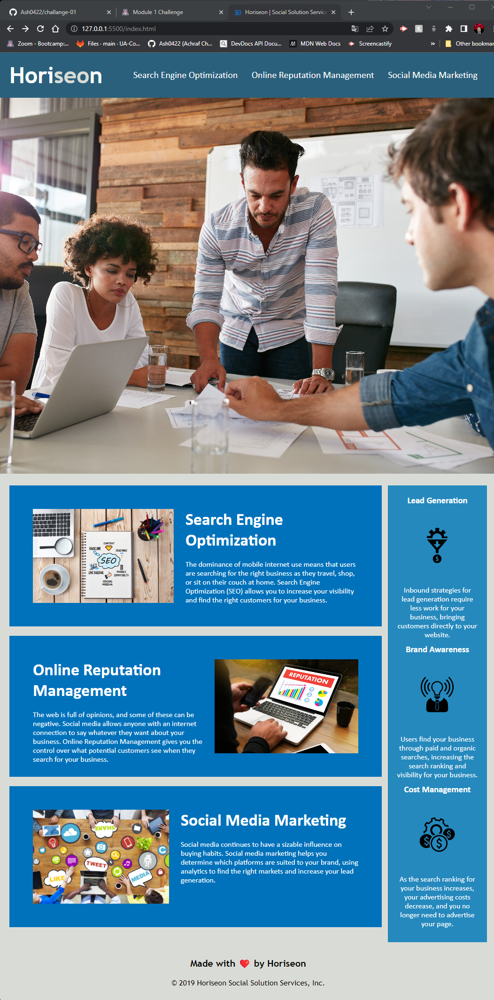

<h1> Challange 01</h1>
Bootcamp challenge 01 in HTML, CSS, Git Code Refactor

<h2>The challange </h2>
modify a start up code and refactor it without changin what it does to meet a certain set of standards or implement a new technology.

## User Story
<ul>
<li>AS A marketing agency  </li>
<li>I WANT a codebase that follows accessibility standards </li>
<li>SO THAT our own site is optimized for search engines</li>
</ul>

## Acceptance Criteria
<ul>
<li>GIVEN a webpage meets accessibility standards </li>
<li>WHEN I view the source code </li>
<li>THEN I find semantic HTML elements </li>
<li>WHEN I view the structure of the HTML elements </li>
<li>THEN I find that the elements follow a logical structure independent of styling and positioning </li>
<li>WHEN I view the image elements </li>
<li>THEN I find accessible alt attributes </li>
<li>WHEN I view the heading attributes </li>
<li>THEN they fall in sequential order </li>
<li>WHEN I view the title element </li>
<li>THEN I find a concise, descriptive title </li>
</ul>

## Screenshot
 

## The modification I mmade:

<ul>
<li>Structure and Descriptive comments were added: header, main content, aside content, page footer.  </li>
<li>change title to "Horiseon | Social Solution Services" </li>
<li>Change the -div- to -header- </li>
<li>Changed the -div- to -nav- in HTML, and changed .header nav in CSS. </li>
<li>Added a -main- tag in the main conetents </li>
<li>change the -div- in the footer to -footer- </li>
<li>Changed the -div- for benifits to -aside-  </li>
<li>added -alt- properties and description for each image </li>
</ul>

## Links to the challange
 
The challange was upload to Github at the following repository: 
GitHub Repo(https://github.com/Ash0422/challange-01) 
 
deployed application: (https://ash0422.github.io/challange-01/)

